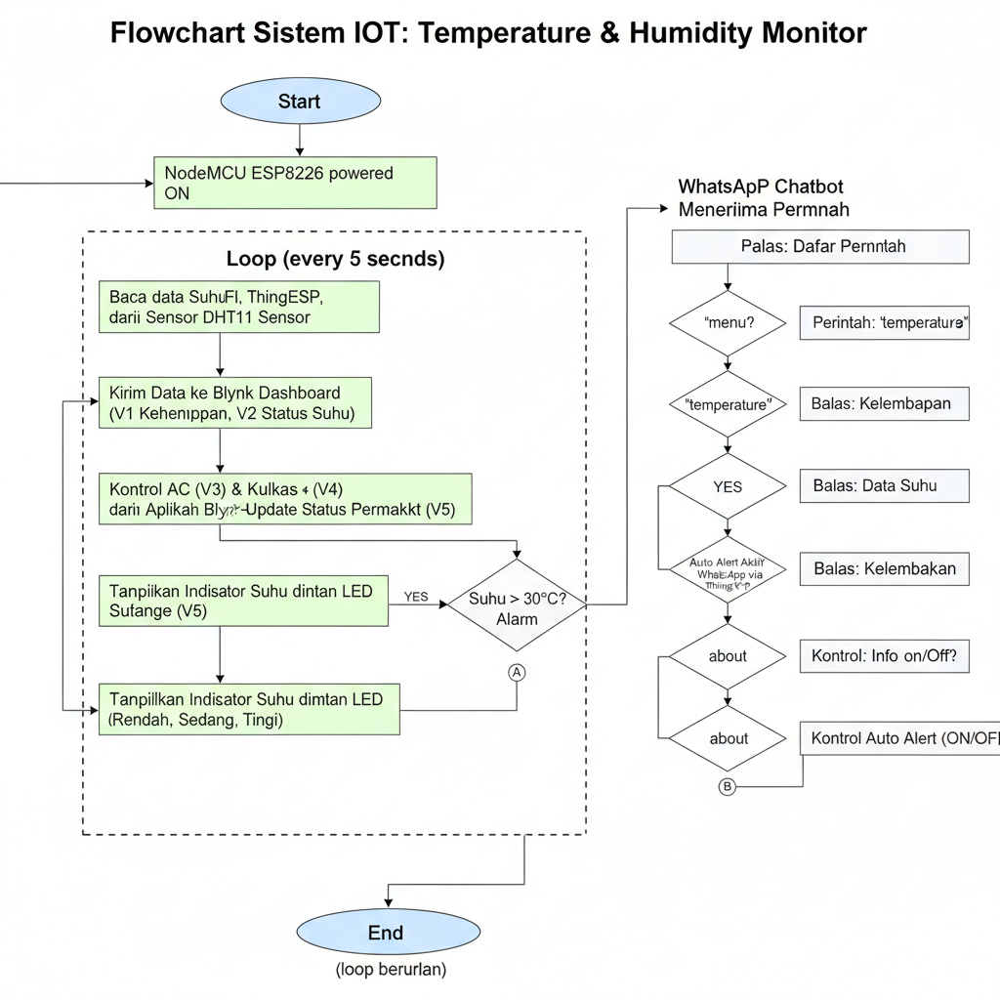

# 🌡️ Temperature & Humidity Monitor with WhatsApp Chatbot + Blynk + Auto Alert + Buzzer

---

## 📖 Deskripsi
Project IoT berbasis **NodeMCU ESP8266** dan sensor **DHT11** untuk memantau suhu & kelembapan ruangan.  
Data dikirim ke **Blynk Dashboard**, dapat dikontrol via **WhatsApp Chatbot** menggunakan ThingESP, serta dilengkapi **Auto Alert WhatsApp** dan **Buzzer Alarm**.

---

## ⚙️ Hardware
- 🟦 NodeMCU ESP8266  
- 🌡️ Sensor DHT11 (Pin D4 / GPIO2)  
- 💡 LED Indikator Suhu:  
  - D5 → Rendah 🔵  
  - D6 → Sedang 🟢  
  - D7 → Tinggi 🔴  
- ❄️ LED AC (D2)  
- 🧊 LED Kulkas (D3)  
- 🔔 Buzzer (D8)  

---

## 🛠️ Software & Library
- [Arduino IDE](https://www.arduino.cc/en/software)
- Library:  
  - `ESP8266WiFi`  
  - `ThingESP`  
  - `DHT`  
  - `BlynkSimpleEsp8266`  

---

## 🚀 Fitur
- ✅ Monitoring suhu & kelembapan via **Blynk Dashboard**  
- ✅ Kontrol **AC & Kulkas** dari Blynk  
- ✅ **WhatsApp Chatbot** dengan command:
  - `menu` → daftar perintah  
  - `temperature` → cek suhu  
  - `humidity` → cek kelembapan  
  - `about` → info perangkat  
  - `alert on` → aktifkan auto alert  
  - `alert off` → nonaktifkan auto alert  
- ✅ **Auto Alert WhatsApp** jika suhu > 31°C  
- ✅ Indikator suhu dengan **LED & buzzer alarm**  

---

## 📲 Blynk Dashboard Mapping

| Widget           | Virtual Pin | Fungsi                     |
|------------------|-------------|-----------------------------|
| Gauge (Suhu)     | V0          | Menampilkan suhu (°C)      |
| Gauge (Humidity) | V1          | Menampilkan kelembapan (%) |
| Label Status     | V2          | Status level suhu (RENDAH/SEDANG/TINGGI) |
| Switch AC        | V3          | Kontrol AC (ON/OFF)        |
| Switch Kulkas    | V4          | Kontrol Kulkas (ON/OFF)    |
| Label Perangkat  | V5          | Menampilkan status AC & Kulkas |

---

## 📡 Flow Sistem
1. NodeMCU membaca sensor DHT11 setiap 5 detik.  
2. Data suhu & kelembapan dikirim ke **Blynk Cloud**.  
3. LED indikator & buzzer memberikan peringatan suhu.  
4. WhatsApp Chatbot menerima perintah & mengirim respon.  
5. Jika auto alert aktif dan suhu > 31°C → sistem otomatis kirim peringatan via WhatsApp.  

---

## 📸 Preview Dashboard
/docs/flowchart.png

---

## 📸 System Flow

---

## 📜 Lisensi
MIT License © 2025 Hibban
